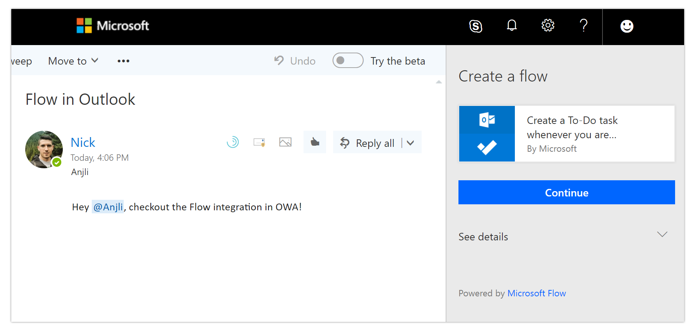

---

title: Create a flow for Microsoft To-Do in Outlook Web App
description: A popular feature in Outlook is the sender's ability to explicitly call out a person on the recipient list to draw his or her attention to the email.
author: MargoC
manager: AnnBe
ms.date: 4/27/2018
ms.topic: article
ms.prod: 
ms.service: business-applications
ms.technology: 
ms.author: margoc
audience: Admin

---
#  Create a flow for Microsoft To-Do in Outlook Web App

[!include[banner](../../../includes/banner.md)]

A popular feature in Outlook is the sender's ability to explicitly call out a
person on the recipient list to draw his or her attention to the email. This is
done by including the at sign (\@) before the name of the person, which causes
the name of the recipient to be highlighted in the email and the recipient's
email to be automatically included in the To line. By \@mentioning someone in an
email, you can call the recipient's attention to an action item assigned to
them.

Now, with just a few clicks, create a flow that automatically creates a task in
Microsoft To-Do whenever someone is \@mentioned in an email message. That way,
tasks they need to follow up on are centrally located in the Microsoft To-Do
app.

<!-- Picture 28 -->

*Flow creation in Outlook Web App*

The task contains the context from the email for reference, such as the sender
and the body of the email. The recipient can add additional context, such as the
due date and categorization, from within the To-Do app.

At this time, this functionality is available only for Outlook Web App (OWA).
