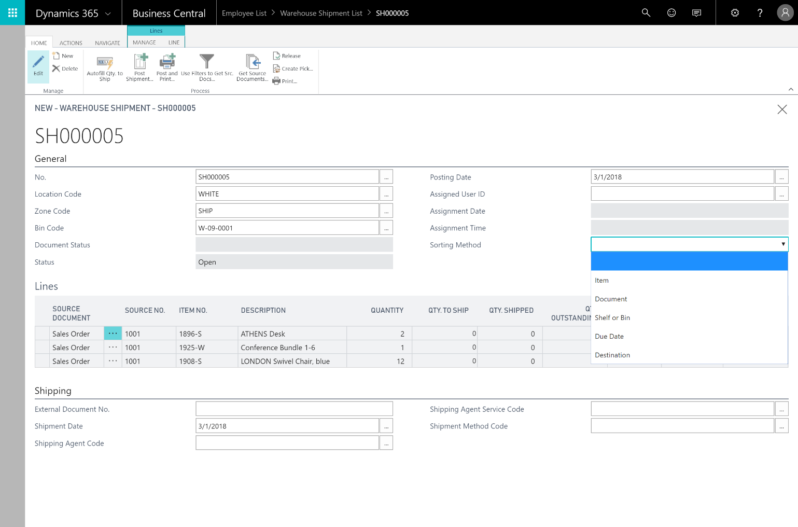

---

title: Manufacturing
description: With **Premium licensing**, you get access to manufacturing capabilities.
author: MargoC
manager: edupont
ms.date: 5/02/2018
ms.topic: article
ms.prod: 
ms.service: business-applications
ms.technology: 
ms.author: andreipa
audience: Admin

---
#  Manufacturing

[!include[banner](../../../includes/banner.md)]

With **Premium licensing**, you get access to manufacturing capabilities.

**Production orders**

Create and manage production orders, and post consumption and output to the
production orders.

<!-- start lab -->
Assign different  **status** to the production orders to manage different stages:
- Planned
- Finished
- Released

Production order is the first class citizen in the supply-chain management area. Learn more [here](supply-chain-management.md)

<!-- stop lab -->

**Version management**

Create and manage different version of the manufacturing bill of materials and
routings.

**Agile manufacturing**

Plan rush hours, make exceptions, and handle last-minute changes to your
processes with multiple planning options.

**Basic supply planning**

Plan for material requirements based on demand, with support for master
production scheduling and materials requirements planning.

**Demand forecasting**

Plan and create production and purchase orders, taking into consideration the
demand forecast together with the level of available inventory and parameters of
requirement planning.

**Capacity planning**

Add capacities to the manufacturing process. Set up routings, and use these
routings on production orders and in material requirements planning.

**Machine centers**

Manage capacity on several levels: on a more detailed level for machine centers
and on a consolidated level for work centers.

**Finite loading**

Take capacity constraints into account, so that no more work is assigned to a
work center than the capacities can be expected to execute during a given time
period.
