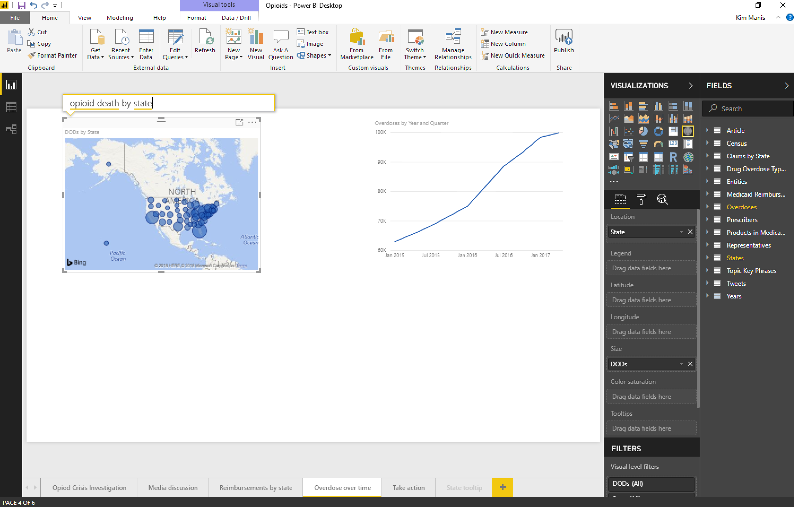

---

title: Ask Top N questions in Q&A
description: Use ad hoc analysis in Q&A to ask Top N questions, such as “What are my top 10 customers by sales?” Users can ask these questions in Power BI Desktop when authoring a visual, in the Power BI Service while viewing a dashboard, or on mobile using voice.
author: MI77
manager: AnnBe
ms.date: 4/30/2018
ms.topic: article
ms.prod: 
ms.service: business-applications
ms.technology: 
ms.author: willthom
audience: business analyst, developer

---
#  Ask Top N questions in Q&A

[!include[banner](../../../includes/banner.md)]

Use ad hoc analysis in Q&A to ask Top N questions, such as “What are my top 10
customers by sales?” Users can ask these questions in Power BI Desktop when
authoring a visual, in the Power BI Service while viewing a dashboard, or on
mobile using voice.

*Example of a question-based query in a report*

