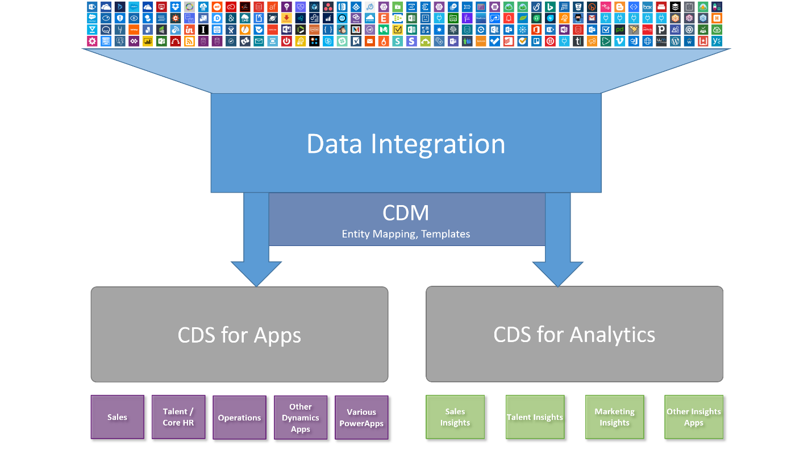

---

title: Data Integration
description: Data Integration provides the connectors and gateways that make it possible to bring any external data into the Common Data Service (CDS) and store the data in Common Data Model (CDM) form.
author: MargoC
manager: AnnBe
ms.date: 4/26/2018
ms.topic: article
ms.prod: 
ms.service: business-applications
ms.technology: 
ms.author: margoc
audience: Admin

---
#  Data Integration

[!include[banner](../../includes/banner.md)]

Data Integration provides the connectors and gateways that make it possible to
bring any external data into the Common Data Service (CDS) and store the data in
Common Data Model (CDM) form. This makes it easier for customers to integrate
their data in a single place for business applications and analytics. Data
Integration is based on Power Query, the same technology that millions of people
use daily in Power BI and Excel.

<!-- picture -->

*Data Integration connectors*

Data Integration provides direct connectivity to hundreds of business-critical
data sources as well as:

-   Hybrid connectivity via the on-premises data gateway.

-   Integration into Power BI, PowerApps, Logic Apps, Microsoft Flow, Azure
    Analysis Services, and Office 365 (Power Query in Excel).
